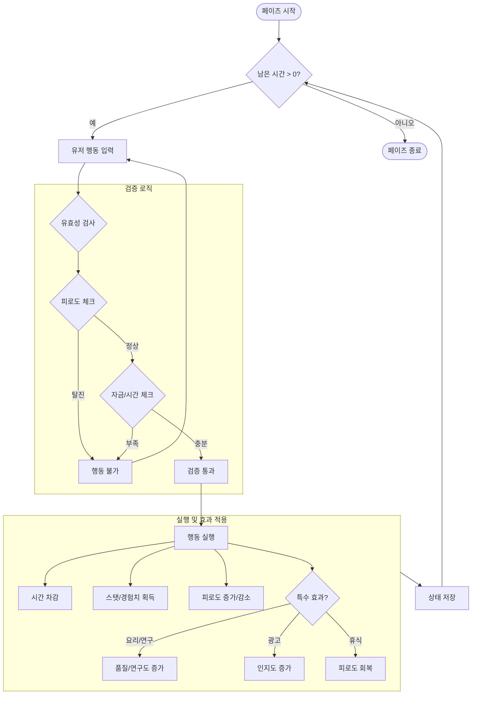
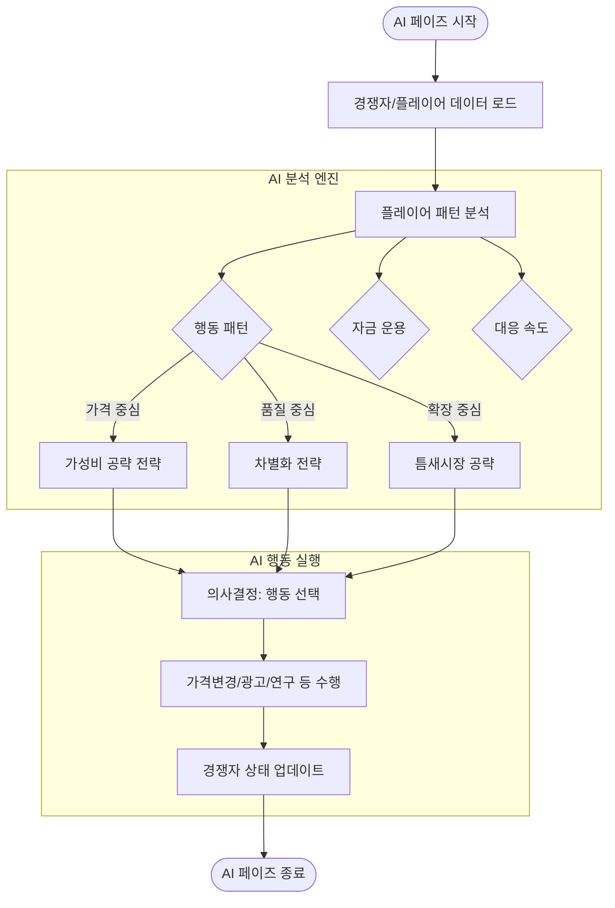
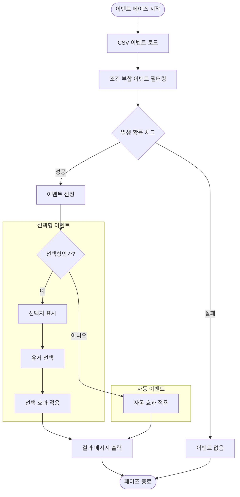

# 🎮 게임 로직 상세 순서도 (Game Logic Flowchart)

본 문서는 `Chickenmaster2` 게임의 내부 작동 로직과 하루(Turn) 루프를 상세하게 시각화한 자료입니다.

## 1. 🔄 전체 게임 루프 (Main Game Loop)

게임의 시작부터 종료까지의 거시적인 흐름입니다.

```mermaid
flowchart TD
    Start((게임 시작)) --> Init[초기화: 플레이어/매장/경쟁자 생성]
    Init --> TurnStart{턴 시작}

    subgraph DailyLoop [하루 일과 (1 Turn)]
        direction TB
        Phase1[1. 플레이어 행동 페이즈] --> Phase2[2. AI 행동 페이즈]
        Phase2 --> Phase3[3. 이벤트 페이즈]
        Phase3 --> Phase4[4. 판매 페이즈]
        Phase4 --> Phase5[5. 정산 페이즈]
        Phase5 --> Phase6[6. 마무리 페이즈]
    end

    TurnStart --> DailyLoop
    Phase6 --> CheckEnd{게임 종료 조건?}
    CheckEnd -- 아니오 --> NextTurn[다음 날짜로 변경]
    NextTurn --> TurnStart
    CheckEnd -- 예 --> GameOver((게임 종료))
```

---

## 2. 🕹️ 1단계: 플레이어 행동 페이즈 (Player Action Phase)

플레이어가 주어진 시간(12시간)을 사용하여 경영 활동을 수행하는 로직입니다.



> **🛠️ 기술적 고려사항 (Technical Note)**
> *   **검증(Validation):** 자금 및 피로도 체크는 메모리나 캐시가 아닌 **DB의 현재 상태(Snapshot)**를 기준으로 즉시 판단해야 데이터 불일치를 방지할 수 있습니다.
> *   **트랜잭션(Transaction):** 행동 실행 단계의 '자금 차감'과 '효과 적용(능력치 상승)'은 반드시 **원자적(Atomic)**으로 처리되어야 합니다. (예: 돈만 빠져나가고 능력치는 오르지 않는 버그 방지)

---

## 3. 🤖 2단계: AI 행동 페이즈 (AI Action Phase)

경쟁자 AI가 플레이어를 분석하고 전략적 행동을 결정하는 로직입니다.



> **🛠️ 기술적 고려사항 (Technical Note)**
> *   **데이터 참조:** AI는 플레이어 데이터를 **'읽기(Read)'만** 하고, 자신의 데이터만 **'쓰기(Write)'**하므로 동시성 문제 발생 확률이 낮습니다.
> *   **확장성(Extensibility):** 분석 엔진(Analysis) 부분은 인터페이스로 분리되어 있어, 추후 룰 기반 AI에서 강화학습(RL) 모델 등으로 교체하더라도 전체 게임 루프에 영향을 주지 않습니다.

---

## 4. 🎲 3단계: 이벤트 페이즈 (Event Phase)

랜덤 또는 조건부 이벤트가 발생하고 플레이어에게 선택을 요구하는 로직입니다.



> **🛠️ 기술적 고려사항 (Technical Note)**
> *   **로그 저장 (Raw Data):** 이벤트 발생 내역과 유저의 선택 결과는 게임 밸런싱과 CS 처리에 중요합니다. **'이벤트 로그 테이블'**에 Raw Data 형태로 기록해두는 것이 좋습니다.

---

## 5. 💰 4단계: 판매 페이즈 (Sales Phase)

고객이 매장을 방문하여 제품을 구매하고 피드백을 남기는 시뮬레이션입니다.

```mermaid
flowchart TD
    Start([판매 페이즈 시작]) --> MarketCalc[시장 평균 가격/품질/인지도 계산]
    MarketCalc --> GenCust[고객 생성 (AI 10% + 수치 90%)]

    subgraph AICustomer [AI 고객 시뮬레이션 (1명 단위)]
        GenCust --> Eval[제품 평가]
        Eval --> Score{구매 점수 계산}

        subgraph Scoring [평가 기준]
            Score --> Price[가격 점수]
            Score --> Quality[품질 점수]
            Score --> Awareness[인지도 점수]
            Score --> Desire[개인 욕구]
        end

        Price & Quality & Awareness & Desire --> Decision{구매 여부 결정}
        Decision -- 구매 --> Buy[매출 발생]
        Decision -- 비구매 --> Skip[패스]

        Buy --> Feedback{피드백 작성?}
        Feedback -- 예 --> GenFeedback[롤러코스터 타이쿤식 대사 생성]
        Feedback -- 아니오 --> NextCust
    end

    subgraph NumericCustomer [수치적 고객 계산 (대량)]
        GenCust --> CalcShare[점유율 계산]
        CalcShare --> BulkBuy[점유율 비례 매출 확정]
    end

    NextCust & BulkBuy --> Aggregation[총 매출/고객 집계]
    Aggregation --> End([페이즈 종료])
```

> **🛠️ 기술적 고려사항 (Technical Note)**
> *   **하이브리드 처리:** 전체 고객(예: 1,000명)을 개별 시뮬레이션하는 것은 비효율적입니다. AI(10%)와 수치(90%)를 나누어 처리하는 방식은 연산 비용을 최적화합니다.
> *   **데이터 최적화:**
>     *   **AI 고객:** 생성된 텍스트 피드백은 휘발성 데이터로 처리하거나, 의미 있는 것만 선별하여 저장합니다.
>     *   **수치 고객:** 개별 구매 이력이 아닌 `판매량: 900`, `매출: 450만` 형태의 **집계 데이터(Aggregated Data)**만 DB에 저장하여 용량을 절약해야 합니다.

---

## 6. 📊 5단계: 정산 페이즈 (Settlement Phase)

하루 동안의 매출과 비용을 정산하여 순이익을 계산하는 로직입니다.

```mermaid
flowchart TD
    Start([정산 페이즈 시작]) --> LoadRevenue[일일 매출 로드]

    subgraph CostCalc [비용 계산]
        LoadRevenue --> CalcRent[임대료 (월세/30)]
        LoadRevenue --> CalcMaterial[재료비 (매출 비례)]
        LoadRevenue --> CalcLabor[인건비]
        LoadRevenue --> CalcMaint[유지보수비]
    end

    CalcRent & CalcMaterial & CalcLabor & CalcMaint --> TotalCost[총 비용 합산]

    TotalCost --> CalcProfit{순이익 계산}
    CalcProfit --> NetProfit[매출 - 비용]

    NetProfit --> UpdateMoney[플레이어 자금 반영]
    UpdateMoney --> CheckBankrupt{자금 < 0?}

    CheckBankrupt -- 예 --> Warning[파산 경고]
    CheckBankrupt -- 아니오 --> Report[정산 리포트 생성]

    Warning & Report --> End([페이즈 종료])
```

> **🛠️ 기술적 고려사항 (Technical Note)**
> *   **파생 데이터 관리:** 순이익(NetProfit)은 매출-비용으로 언제든 계산 가능하지만, 게임 내 **'일별 기록(Daily History)'** 조회를 빠르게 하기 위해 매 턴 종료 시 **정산 결과 스냅샷**을 DB에 저장해두는 것이 성능상 유리합니다.
