# 🎮 게임 로직 상세 순서도 (Game Logic Flowchart)

본 문서는 `Chickenmaster2` 게임의 내부 작동 로직과 하루(Turn) 루프를 상세하게 시각화한 자료입니다.

## 1. 🔄 전체 게임 루프 (Main Game Loop)

게임의 시작부터 종료까지의 거시적인 흐름입니다.

```mermaid
flowchart TD
    Start((게임 시작)) --> Init[초기화: 플레이어/매장/경쟁자 생성]
    Init --> TurnStart{턴 시작}

    subgraph DailyLoop [하루 일과 (1 Turn)]
        direction TB
        Phase1[1. 플레이어 행동 페이즈] --> Phase2[2. AI 행동 페이즈]
        Phase2 --> Phase3[3. 이벤트 페이즈]
        Phase3 --> Phase4[4. 판매 페이즈]
        Phase4 --> Phase5[5. 정산 페이즈]
        Phase5 --> Phase6[6. 마무리 페이즈]
    end

    TurnStart --> DailyLoop
    Phase6 --> CheckEnd{게임 종료 조건?}
    CheckEnd -- 아니오 --> NextTurn[다음 날짜로 변경]
    NextTurn --> TurnStart
    CheckEnd -- 예 --> GameOver((게임 종료))
```

---

## 2. 🕹️ 1단계: 플레이어 행동 페이즈 (Player Action Phase)

플레이어가 주어진 시간(12시간)을 사용하여 경영 활동을 수행하는 로직입니다.

```mermaid
flowchart TD
    Start([페이즈 시작]) --> CheckTime{남은 시간 > 0?}
    CheckTime -- 예 --> Input[유저 행동 입력]
    Input --> Validate{유효성 검사}

    subgraph Validation [검증 로직]
        Validate --> CheckFatigue{피로도 체크}
        CheckFatigue -- 탈진 --> Fail[행동 불가]
        CheckFatigue -- 정상 --> CheckCost{자금/시간 체크}
        CheckCost -- 부족 --> Fail
        CheckCost -- 충분 --> Success[검증 통과]
    end

    Fail --> Input
    Success --> Execute[행동 실행]

    subgraph Execution [실행 및 효과 적용]
        Execute --> CalcTime[시간 차감]
        Execute --> CalcStat[스탯/경험치 획득]
        Execute --> CalcFatigue[피로도 증가/감소]
        Execute --> SpecialEffect{특수 효과?}

        SpecialEffect -- 요리/연구 --> QualityUp[품질/연구도 증가]
        SpecialEffect -- 광고 --> AwarenessUp[인지도 증가]
        SpecialEffect -- 휴식 --> Recovery[피로도 회복]
    end

    Execution --> Save[상태 저장]
    Save --> CheckTime
    CheckTime -- 아니오 --> End([페이즈 종료])
```



---

## 3. 🤖 2단계: AI 행동 페이즈 (AI Action Phase)

경쟁자 AI가 플레이어를 분석하고 전략적 행동을 결정하는 로직입니다.

```mermaid
flowchart TD
    Start([AI 페이즈 시작]) --> LoadData[경쟁자/플레이어 데이터 로드]
    LoadData --> Analyze[플레이어 패턴 분석]

    subgraph Analysis [AI 분석 엔진]
        Analyze --> Pattern{행동 패턴}
        Analyze --> Resource{자금 운용}
        Analyze --> Timing{대응 속도}

        Pattern -- 가격 중심 --> Strategy1[가성비 공략 전략]
        Pattern -- 품질 중심 --> Strategy2[차별화 전략]
        Pattern -- 확장 중심 --> Strategy3[틈새시장 공략]
    end

    Strategy1 & Strategy2 & Strategy3 --> Decision[의사결정: 행동 선택]

    subgraph Action [AI 행동 실행]
        Decision --> AI_Action[가격변경/광고/연구 등 수행]
        AI_Action --> UpdateState[경쟁자 상태 업데이트]
    end

    UpdateState --> End([AI 페이즈 종료])
```



---

## 4. 🎲 3단계: 이벤트 페이즈 (Event Phase)

랜덤 또는 조건부 이벤트가 발생하고 플레이어에게 선택을 요구하는 로직입니다.

```mermaid
flowchart TD
    Start([이벤트 페이즈 시작]) --> LoadEvents[CSV 이벤트 로드]
    LoadEvents --> Filter[조건 부합 이벤트 필터링]
    Filter --> Chance{발생 확률 체크}

    Chance -- 실패 --> NoEvent[이벤트 없음]
    Chance -- 성공 --> Select[이벤트 선정]

    Select --> IsChoice{선택형인가?}

    subgraph ChoiceEvent [선택형 이벤트]
        IsChoice -- 예 --> ShowDialog[선택지 표시]
        ShowDialog --> UserSelect[유저 선택]
        UserSelect --> ApplyChoice[선택 효과 적용]
    end

    subgraph AutoEvent [자동 이벤트]
        IsChoice -- 아니오 --> ApplyAuto[자동 효과 적용]
    end

    ApplyChoice & ApplyAuto --> Result[결과 메시지 출력]
    Result & NoEvent --> End([페이즈 종료])
```



---

## 5. 💰 4단계: 판매 페이즈 (Sales Phase)

고객이 매장을 방문하여 제품을 구매하고 피드백을 남기는 시뮬레이션입니다.

```mermaid
flowchart TD
    Start([판매 페이즈 시작]) --> MarketCalc[시장 평균 가격/품질/인지도 계산]
    MarketCalc --> GenCust[고객 생성 (AI 10% + 수치 90%)]

    subgraph AICustomer [AI 고객 시뮬레이션 (1명 단위)]
        GenCust --> Eval[제품 평가]
        Eval --> Score{구매 점수 계산}

        subgraph Scoring [평가 기준]
            Score --> Price[가격 점수]
            Score --> Quality[품질 점수]
            Score --> Awareness[인지도 점수]
            Score --> Desire[개인 욕구]
        end

        Price & Quality & Awareness & Desire --> Decision{구매 여부 결정}
        Decision -- 구매 --> Buy[매출 발생]
        Decision -- 비구매 --> Skip[패스]

        Buy --> Feedback{피드백 작성?}
        Feedback -- 예 --> GenFeedback[롤러코스터 타이쿤식 대사 생성]
        Feedback -- 아니오 --> NextCust
    end

    subgraph NumericCustomer [수치적 고객 계산 (대량)]
        GenCust --> CalcShare[점유율 계산]
        CalcShare --> BulkBuy[점유율 비례 매출 확정]
    end

    NextCust & BulkBuy --> Aggregation[총 매출/고객 집계]
    Aggregation --> End([페이즈 종료])
```

---

## 6. 📊 5단계: 정산 페이즈 (Settlement Phase)

하루 동안의 매출과 비용을 정산하여 순이익을 계산하는 로직입니다.

```mermaid
flowchart TD
    Start([정산 페이즈 시작]) --> LoadRevenue[일일 매출 로드]

    subgraph CostCalc [비용 계산]
        LoadRevenue --> CalcRent[임대료 (월세/30)]
        LoadRevenue --> CalcMaterial[재료비 (매출 비례)]
        LoadRevenue --> CalcLabor[인건비]
        LoadRevenue --> CalcMaint[유지보수비]
    end

    CalcRent & CalcMaterial & CalcLabor & CalcMaint --> TotalCost[총 비용 합산]

    TotalCost --> CalcProfit{순이익 계산}
    CalcProfit --> NetProfit[매출 - 비용]

    NetProfit --> UpdateMoney[플레이어 자금 반영]
    UpdateMoney --> CheckBankrupt{자금 < 0?}

    CheckBankrupt -- 예 --> Warning[파산 경고]
    CheckBankrupt -- 아니오 --> Report[정산 리포트 생성]

    Warning & Report --> End([페이즈 종료])
```
