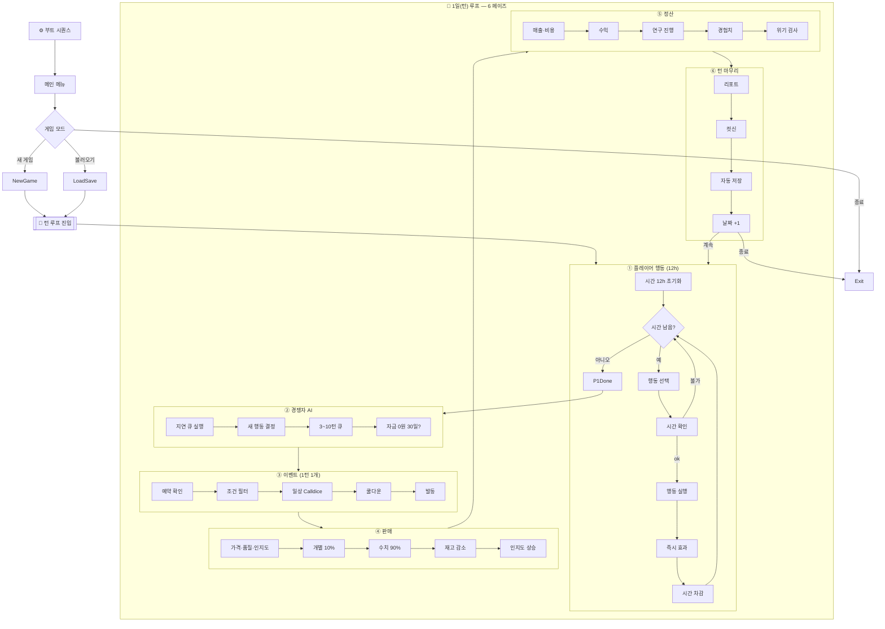

# 🎯 1차 목표 TODO

다음 파일들을 신규로 작성하여 헥사고날 아키텍처(도메인 → 포트 → 애플리케이션 → 어댑터 → 인프라)를 구축합니다.

## ✅ 1. 전역 상수 & 공통 타입 (완료)  
- ✅ `src/constants.py` - 게임 전역 상수 정의
- ✅ `src/common/enums/action_type.py` - 6개 행동 카테고리 + 세부 행동 
- ✅ `src/common/enums/event_type.py` - 5가지 이벤트 분류
- ✅ `src/common/enums/research_type.py` - 4가지 연구 분야
- ✅ `src/common/__init__.py` - 패키지 초기화

## ✅ 2. core / domain (완료) - 모두 `@dataclass(frozen=True)`
- ✅ `src/core/domain/value_objects.py` - 불변 값 객체들
- ✅ `src/core/domain/player.py` - 플레이어 엔티티 (5가지 스탯, 피로도, 자금 등)
- ✅ `src/core/domain/store.py` - 매장 엔티티 (임대료, 제품 관리 등)
- ✅ `src/core/domain/product.py` - 제품 엔티티 (가격, 품질, 인지도)
- ✅ `src/core/domain/recipe.py` - 레시피 엔티티 (연구 진행도, 품질 계산)
- ✅ `src/core/domain/competitor.py` - 경쟁자 AI (지연 행동, 파산 조건)
- ✅ `src/core/domain/research.py` - 연구 시스템 (4가지 분야, 진행도)
- ✅ `src/core/domain/inventory.py` - 재고 관리 (단순화된 수량+품질)
- ✅ `src/core/domain/customer.py` - 고객 AI (10% AI + 90% 수치)
- ✅ `src/core/domain/event.py` - 이벤트 시스템 (CSV 로더 포함)
- ✅ `src/core/domain/event_loader.py` - 이벤트 CSV 로더 포트
- ✅ `src/core/domain/turn.py` - 턴 시스템 (6페이즈, 진행률)
- ✅ `src/core/__init__.py` - 패키지 초기화

## 🚧 3. core / ports (진행 중) - interface 정의
- 🎯 `src/core/ports/repository_port.py` - 게임 데이터 저장/로드 인터페이스 (다음 우선순위)
- ✅ `src/core/ports/event_loader_port.py` - CSV 이벤트 로더 인터페이스 (구현 완료)
- `src/core/ports/action_port.py` - 플레이어 행동 처리 인터페이스
- `src/core/ports/ai_engine_port.py` - 경쟁자 AI 인터페이스
- `src/core/ports/event_engine_port.py` - 이벤트 발생 로직 인터페이스
- `src/core/ports/sales_engine_port.py` - 판매 계산 인터페이스
- `src/core/ports/persistence_port.py` - 세이브/로드 인터페이스
- `src/core/ports/notification_port.py` - UI 알림 인터페이스

## 4. application (서비스)
- `src/application/game_loop_service.py`
- `src/application/action_service.py`
- `src/application/ai_service.py`
- `src/application/event_service.py`
- `src/application/sales_service.py`
- `src/application/accounting_service.py`
- `src/application/research_service.py`
- `src/application/inventory_service.py`

## 5. engines (도메인 로직)
- `src/engine/event_engine.py`
- `src/engine/ai_engine.py`
- `src/engine/dice_system.py` (기존 `game/DiceSystem.py` 래퍼)

## 6. adapters (I/O · 외부 시스템)
- ✅ `src/adapters/repository/csv_event_loader.py` - CSV 이벤트 로더 (완료)
- `src/adapters/repository/json_repository.py` - JSON 데이터 저장소
- `src/adapters/audio/audio_manager.py`
- `src/adapters/assets/asset_loader.py`
- `src/adapters/ui/cli_menu_adapter.py`
- `src/adapters/ui/game_gui_adapter.py`

## 7. infrastructure / bootstrap
- `src/bootstrap/__init__.py`
- `src/bootstrap/di_container.py`
- `src/bootstrap/run_game.py`

## 8. tests (pytest)
- ✅ `tests/test_domain_models.py` - 도메인 모델 단위 테스트 (562줄)
- `tests/domain/test_event_engine.py`
- `tests/application/test_game_loop.py` 
- `tests/adapters/test_json_repository.py`

## 9. 문서 & 자산 메타
- `docs/ARCHITECTURE.md`
- `assets/README_audio.md`

---

## 🎯 **현재 진행 상황 (2024-12-28 업데이트)**

### ✅ **완료된 작업들**
1. **기초 환경 구축**: Docker, requirements.txt, 프로젝트 구조
2. **상수 & Enum 정의**: 게임 내 모든 상수값과 열거형 정의
3. **도메인 모델 완성**: 11개 도메인 엔티티, 모두 불변 객체로 구현
4. **이벤트 CSV 시스템**: `data/events.csv` + EventLoaderPort 인터페이스
5. **단위 테스트**: 562줄의 포괄적인 도메인 모델 테스트
6. **팩토리 메서드 추가**: Player.create_new(), Store.create_new() 구현
7. **Import 경로 수정**: 모든 상대 import를 절대 import로 변경
8. **기능 검증 완료**: 모든 도메인 모델 정상 작동 확인
9. **EventLoaderPort 구현**: CSV 이벤트 로더 완전 구현
10. **어댑터 계층 시작**: adapters/repository 패키지 구조 생성

### 🔧 **수정 완료된 문제들**
- ✅ Dataclass 필드 순서 오류 (Competitor 클래스)
- ✅ Import 경로 오류 (상대 → 절대 경로 변경)
- ✅ 팩토리 메서드 부재 (Player, Store 클래스)
- ✅ 상수 누락 (INITIAL_STAT_VALUE 추가)
- ✅ 테스트 환경 문제 (pytest 버전 충돌 → 직접 테스트)

### 📋 **검증된 기능들**
- 값 객체: Money, Percentage, StatValue 정상 작동
- 플레이어: 팩토리 메서드로 기본 스탯 50, 자금 100만원 생성
- 매장: 팩토리 메서드로 임대료 50만원 기본 생성
- CSV 이벤트: 13개 이벤트 파일 읽기 및 JSON 파싱 정상
- **CSVEventLoader**: EventLoaderPort 인터페이스 완전 구현, 캐시 시스템 포함

### 🚧 **다음 단계 (3단계 - 포트 계층)**
1. **EventLoaderPort 구현체** (CSV 파일 읽기) - 최우선
2. **RepositoryPort 정의** (게임 데이터 저장/로드)
3. **핵심 엔진 포트들** (AI, 이벤트, 판매 로직)

### 🎯 **3단계 상세 계획**
1. ✅ **`src/adapters/repository/csv_event_loader.py`** - EventLoaderPort 구현 (완료)
2. **`src/core/ports/repository_port.py`** - 데이터 영속성 인터페이스 (다음)
3. **`src/adapters/repository/json_repository.py`** - JSON 저장소 구현
4. **나머지 포트 인터페이스들** - 비즈니스 로직용

### 📝 **EventLoaderPort 구현 상세**
- ✅ **CSVEventLoader 클래스**: 완전한 EventLoaderPort 구현
- ✅ **강력한 오류 처리**: 파일 검증, 인코딩, JSON 파싱 오류 
- ✅ **캐시 시스템**: 로드된 이벤트 메모리 캐시, ID 기반 빠른 조회
- ✅ **EventEffect 확장**: NO_EFFECT, HAPPINESS_GAIN, HAPPINESS_LOSS 추가
- ✅ **EventChoice 개선**: 빈 효과 배열 허용 (아무 효과 없는 선택지)
- ✅ **실전 테스트**: 13개 이벤트 CSV 로드 및 모든 기능 검증 완료

---

## 📐 모듈 의존성 다이어그램

```mermaid
flowchart LR
    subgraph DOMAIN["core / domain"]
        direction TB
        Player
        Competitor
        Store
        Product
        Recipe
        InventoryItem
        Research
        CustomerAI
        EventD
        TurnObj
    end

    subgraph PORTS["core / ports"]
        direction TB
        ActionPort
        AIPort
        EventPort
        SalesPort
        RepoPort
        PersistPort
        NotifyPort
    end

    subgraph APP["application"]
        direction TB
        GameLoopSvc
        ActionSvc
        AISvc
        EventSvc
        SalesSvc
        AccountingSvc
        ResearchSvc
        InventorySvc
    end

    subgraph ADAPTERS["adapters"]
        direction TB
        CLI
        GUI
        JsonRepo
        AudioMgr
        AssetLd
    end

    subgraph INFRA["bootstrap / infra"]
        direction TB
        DI
        Runner
    end

    ADAPTERS --> PORTS
    APP -- implements --> PORTS
    APP --> DOMAIN
    INFRA --> ADAPTERS
    INFRA --> APP
```

> 다이어그램은 **의존 방향**을 나타냅니다. 도메인 → 포트로의 의존은 금지되고, 상위 계층(어댑터/인프라)이 하위 계층을 바라보는 형태로 **의존성 역전 원칙**을 유지합니다. 

---

## 🔄 게임 순서도 (부트 시퀀스 + 1일 턴 루프)

> 이 순서도는 부트 → 메뉴 → 새 게임/불러오기 → 1일 6-페이즈 루프의 세부 흐름(12h 시간 자원, 이벤트 1개 제한, AI 지연 행동 등)을 시각화한 것입니다. 