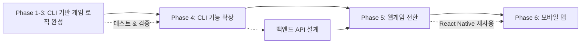
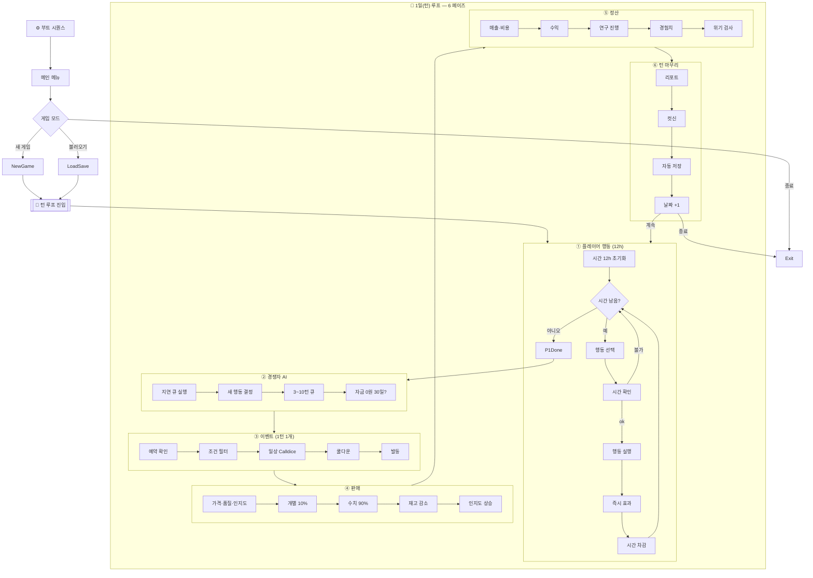

# 🎯 Chickenmaster2 개발 로드맵

> **현재 진척률**: 약 30-35% 완료 (Phase 1 기준)
> **1차 목표**: 플레이 가능한 CLI 게임 (Phase 1-4)
> **2차 목표**: 웹게임 전환 (Phase 5)
> **최종 목표**: 모바일 앱 출시 (Phase 6)

---

## 🚀 Phase 1: 최소 실행 가능 제품 (MVP) - **최우선**

### 목표: 1턴이라도 플레이 가능하게 만들기

헥사고날 아키텍처(도메인 → 포트 → 애플리케이션 → 어댑터 → 인프라)의 핵심 계층 구현


### 1.1 핵심 엔진 구현 (필수) 🔥

**우선순위 1: DiceSystem (주사위 시스템)**
```python
# src/engine/dice_system.py - 게임의 핵심 메커니즘
```
- ❌ `calldice(threshold: int, stat_bonus: int) -> tuple[int, bool]`
  - D100 주사위 굴림
  - 스탯 보너스 적용
  - 성공/실패 판정
- ❌ 테스트: `tests/engine/test_dice_system.py`

**예상 시간**: 1~2시간
**중요도**: ⭐⭐⭐⭐⭐ (이것 없으면 게임 불가)

---

**우선순위 2: Repository Port (데이터 영속성)**
```python
# src/core/ports/repository_port.py - 저장/로드 인터페이스
```
- ❌ `RepositoryPort` ABC 클래스 정의
  - `save_player(player: Player) -> bool`
  - `load_player(player_id: UUID) -> Optional[Player]`
  - `save_game(save_name: str, game_data: dict) -> bool`
  - `load_game(save_name: str) -> Optional[dict]`
  - `save_turn(turn: Turn) -> bool`
  - `load_current_turn() -> Optional[Turn]`

**예상 시간**: 1시간
**중요도**: ⭐⭐⭐⭐⭐

---

**우선순위 3: JSON Repository (구현체)**
```python
# src/adapters/repository/json_repository.py
```
- ❌ `JsonRepository(RepositoryPort)` 클래스 구현
  - `saves/` 디렉토리에 JSON 파일 저장
  - Player, Turn 직렬화/역직렬화
  - 에러 핸들링
- ❌ 테스트: `tests/adapters/test_json_repository.py`

**예상 시간**: 2~3시간
**중요도**: ⭐⭐⭐⭐⭐

---

### 1.2 최소 CLI UI 구현

**우선순위 4: CLI 어댑터**
```python
# src/adapters/ui/cli_adapter.py - 콘솔 입출력
```
- ❌ 메인 메뉴 (새 게임 / 불러오기 / 종료)
- ❌ 행동 선택 메뉴 (6가지 카테고리)
- ❌ 주사위 결과 출력
- ❌ 턴 종료 리포트
- ❌ 간단한 상태 표시 (자금, 피로도, 턴 수)

**예상 시간**: 3~4시간
**중요도**: ⭐⭐⭐⭐⭐

---

### 1.3 게임 루프 연결

**우선순위 5: 게임 진입점**
```python
# src/main.py - DI 컨테이너 없이 직접 연결
```
- ❌ JsonRepository 인스턴스 생성
- ❌ GameLoopService 연결
- ❌ ActionService 연결
- ❌ CLI 어댑터 연결
- ❌ 1턴 플레이 가능하도록 통합

**예상 시간**: 2~3시간
**중요도**: ⭐⭐⭐⭐⭐

---

### Phase 1 체크리스트 ✅

- [ ] DiceSystem 구현 및 테스트
- [ ] RepositoryPort 인터페이스 정의
- [ ] JsonRepository 구현 및 테스트
- [ ] CLI 어댑터 기본 메뉴
- [ ] main.py 통합
- [ ] **1턴 플레이 가능 확인**

**Phase 1 완료 조건**: 
```bash
uv run python src/main.py
# → 게임 시작 → 행동 1개 선택 → 주사위 판정 → 턴 종료
```

**예상 총 소요 시간**: 10~15시간

---

## 🎮 Phase 2: 기본 게임 루프 완성

### 2.1 나머지 포트 인터페이스

- [ ] `src/core/ports/ai_engine_port.py` - AI 판단 인터페이스
- [ ] `src/core/ports/event_engine_port.py` - 이벤트 발생 로직
- [ ] `src/core/ports/sales_engine_port.py` - 판매 계산
- [ ] `src/core/ports/notification_port.py` - UI 알림

**예상 시간**: 2~3시간

---

### 2.2 엔진 계층 구현

**AI 엔진**
```python
# src/engine/ai_engine.py
```
- [ ] `AIEngine(AIEnginePort)` 구현
- [ ] 경쟁자 AI 행동 결정 로직
- [ ] 지연 행동 큐 처리 (3~10턴)
- [ ] 전략 기반 판단 (공격적/방어적)

**예상 시간**: 4~6시간
**중요도**: ⭐⭐⭐⭐

---

**이벤트 엔진**
```python
# src/engine/event_engine.py
```
- [ ] `EventEngine(EventEnginePort)` 구현
- [ ] 이벤트 발생 조건 체크
- [ ] 쿨다운 관리
- [ ] 일상/선택/위기/연쇄 이벤트 분기
- [ ] README 규칙대로 1턴 1개 제한

**예상 시간**: 3~5시간
**중요도**: ⭐⭐⭐⭐

---

**판매 엔진**
```python
# src/engine/sales_engine.py
```
- [ ] 점유율 계산 (가격/품질/인지도)
- [ ] 10% AI 고객 개별 판정
- [ ] 90% 수치 고객 자동 분배
- [ ] 재고 차감

**예상 시간**: 4~6시간
**중요도**: ⭐⭐⭐⭐

---

### 2.3 응용 서비스 보완

**기존 서비스 점검 및 보완**
- [ ] `GameLoopService` - 6페이즈 완전 구현
- [ ] `ActionService` - 모든 행동 타입 처리
- [ ] `AIService` - 엔진 연결
- [ ] `EventService` - 이벤트 엔진 연결
- [ ] `SalesService` - 판매 엔진 연결

**예상 시간**: 5~8시간

---

### Phase 2 체크리스트 ✅

- [ ] 모든 포트 인터페이스 정의
- [ ] AI 엔진 구현
- [ ] 이벤트 엔진 구현
- [ ] 판매 엔진 구현
- [ ] 응용 서비스 보완
- [ ] **10턴 연속 플레이 가능**

**Phase 2 완료 조건**: 
- AI 경쟁자가 행동함
- 이벤트가 발생함
- 판매가 일어나고 자금이 증감함
- 10일 생존 가능

**예상 총 소요 시간**: 18~28시간

---

## 🏆 Phase 3: 게임 콘텐츠 확장

### 3.1 콘텐츠 추가

**이벤트 확장**
- [ ] 이벤트 100개 작성 (현재 13개)
  - [ ] 일상 이벤트 60개
  - [ ] 선택 이벤트 20개
  - [ ] 위기 이벤트 10개
  - [ ] 연쇄 이벤트 10개

**예상 시간**: 10~15시간 (기획 포함)

---

**레시피 추가**
- [ ] 기본 레시피 5개 (후라이드 치킨 외)
- [ ] 연구 레시피 10개
- [ ] 이벤트 레시피 5개

**예상 시간**: 3~5시간

---

### 3.2 UI 개선

**CLI 고도화**
- [ ] 컬러 출력 (colorama)
- [ ] ASCII 아트 타이틀
- [ ] 진행 바
- [ ] 상태창 개선
- [ ] 도움말 시스템

**예상 시간**: 4~6시간

---

### 3.3 밸런싱 & 테스트

- [ ] 10회 이상 플레이테스트
- [ ] 난이도 조정
- [ ] 버그 수정
- [ ] 통합 테스트 작성

**예상 시간**: 8~12시간

---

### Phase 3 체크리스트 ✅

- [ ] 이벤트 100개 완성
- [ ] 레시피 20개 완성
- [ ] CLI UI 고도화
- [ ] **30일 생존 가능**
- [ ] 플레이테스트 완료

**Phase 3 완료 조건**: 
- 친구에게 보여줄 수 있는 수준
- 엔딩까지 도달 가능

**예상 총 소요 시간**: 25~38시간

---

## 🌟 Phase 4: CLI 완성 및 고급 기능

### 4.1 CLI 고급 기능

- [ ] 점장 시스템
- [ ] 2호점 확장
- [ ] 업적 시스템
- [ ] 캐릭터 언락
- [ ] 난이도 옵션
- [ ] 자동 저장/불러오기

**예상 시간**: 15~25시간

---

### 4.2 CLI UI 고도화

- [ ] Pygame 기반 2D GUI (선택사항)
- [ ] 픽셀아트 스타일
- [ ] 마우스 조작
- [ ] 사운드 효과

**예상 시간**: 20~30시간

---

## 🌐 Phase 5: 웹게임 전환

### 5.1 백엔드 API 개발

**FastAPI 기반 REST API**
```python
# backend/main.py
```
- [ ] 게임 상태 관리 API
- [ ] 행동 처리 API
- [ ] 저장/불러오기 API
- [ ] WebSocket 실시간 업데이트

**예상 시간**: 15~20시간
**기술 스택**: FastAPI, Pydantic, uvicorn

---

### 5.2 프론트엔드 개발

**React 기반 SPA**
```javascript
// frontend/src/
```
- [ ] 게임 화면 컴포넌트
- [ ] 행동 선택 UI
- [ ] 상태 표시 대시보드
- [ ] 이벤트 모달
- [ ] 반응형 디자인

**예상 시간**: 25~35시간
**기술 스택**: React, TypeScript, Tailwind CSS

---

### 5.3 웹게임 배포

- [ ] Docker 컨테이너화
- [ ] Vercel/Netlify 프론트엔드 배포
- [ ] Railway/Render 백엔드 배포
- [ ] PostgreSQL 연결
- [ ] 사용자 인증 (Firebase Auth)

**예상 시간**: 10~15시간

---

### Phase 5 체크리스트 ✅

- [ ] FastAPI 백엔드 완성
- [ ] React 프론트엔드 완성
- [ ] 웹에서 플레이 가능
- [ ] 배포 완료
- [ ] **친구들에게 URL 공유 가능**

**Phase 5 완료 조건**: 
- 브라우저에서 게임 플레이 가능
- 모바일 브라우저에서도 작동

**예상 총 소요 시간**: 50~70시간

---

## 📱 Phase 6: 모바일 앱 전환

### 6.1 React Native 앱 개발

**크로스 플랫폼 모바일 앱**
```javascript
// mobile/
```
- [ ] React Native 프로젝트 초기화
- [ ] 게임 화면 컴포넌트 (네이티브)
- [ ] 터치 인터페이스 최적화
- [ ] 오프라인 모드 지원
- [ ] 로컬 저장소 (AsyncStorage)

**예상 시간**: 30~40시간
**기술 스택**: React Native, Expo, TypeScript

---

### 6.2 네이티브 기능 통합

- [ ] 푸시 알림 (턴 종료 알림)
- [ ] 앱 아이콘 & 스플래시 화면
- [ ] 진동 피드백
- [ ] 인앱 구매 (선택사항)
- [ ] 광고 통합 (선택사항)

**예상 시간**: 15~25시간

---

### 6.3 스토어 출시

- [ ] Google Play Console 등록
- [ ] App Store Connect 등록
- [ ] 스크린샷 & 설명 작성
- [ ] 베타 테스트 (TestFlight/내부 테스트)
- [ ] 정식 출시

**예상 시간**: 10~15시간 (심사 대기 제외)

---

### Phase 6 체크리스트 ✅

- [ ] React Native 앱 완성
- [ ] Android APK 빌드
- [ ] iOS IPA 빌드
- [ ] 스토어 출시
- [ ] **앱 스토어에서 다운로드 가능**

**Phase 6 완료 조건**: 
- Google Play/App Store에 앱 등록
- 실제 사용자 플레이 가능

**예상 총 소요 시간**: 55~80시간

---

## 📊 전체 로드맵 요약

| Phase | 목표 | 플랫폼 | 예상 시간 | 우선순위 |
|-------|------|--------|-----------|----------|
| **Phase 1** | MVP - 1턴 플레이 | CLI | 10~15시간 | 🔥🔥🔥🔥🔥 |
| **Phase 2** | 기본 게임 루프 | CLI | 18~28시간 | 🔥🔥🔥🔥 |
| **Phase 3** | 콘텐츠 확장 | CLI | 25~38시간 | 🔥🔥🔥 |
| **Phase 4** | CLI 완성 & 고급 기능 | CLI | 35~55시간 | 🔥🔥 |
| **Phase 5** | 웹게임 전환 | Web | 50~70시간 | 🔥🔥 |
| **Phase 6** | 모바일 앱 | iOS/Android | 55~80시간 | 🔥 |

**총 예상 시간**: 193~286시간

### 플랫폼별 개발 전략



**핵심 원칙**: 
1. **Phase 1-4**: CLI로 게임 로직을 완전히 검증
2. **Phase 5**: 검증된 로직을 API로 감싸고 웹 UI 추가
3. **Phase 6**: 웹 프론트엔드 코드를 React Native로 전환

---

## 🎯 이번 주 목표 (Week 1)

### 최우선 작업 (Phase 1 완료)

1. **DiceSystem 구현** (2h)
   ```python
   # src/engine/dice_system.py
   def calldice(threshold: int, stat_bonus: int = 0) -> tuple[int, bool]:
       pass
   ```

2. **RepositoryPort 정의** (1h)
   ```python
   # src/core/ports/repository_port.py
   class RepositoryPort(ABC):
       pass
   ```

3. **JsonRepository 구현** (3h)
   ```python
   # src/adapters/repository/json_repository.py
   class JsonRepository(RepositoryPort):
       pass
   ```

4. **CLI 어댑터** (4h)
   ```python
   # src/adapters/ui/cli_adapter.py
   ```

5. **통합 및 테스트** (3h)
   ```python
   # src/main.py
   ```

**이번 주말 목표**: Phase 1 완료 (1턴 플레이 가능)

---

## ✅ 완료된 작업 (2026-01-27 업데이트)
## ✅ 완료된 작업 (2026-01-27 업데이트)

### 1. 전역 상수 & 공통 타입 (완료)  
- ✅ `src/constants.py` - 게임 전역 상수 정의
- ✅ `src/common/enums/action_type.py` - 6개 행동 카테고리 + 세부 행동 
- ✅ `src/common/enums/event_type.py` - 5가지 이벤트 분류
- ✅ `src/common/enums/research_type.py` - 4가지 연구 분야
- ✅ `src/common/__init__.py` - 패키지 초기화

### 2. core / domain (완료) - 모두 `@dataclass(frozen=True)`
- ✅ 11개 도메인 엔티티 완전 구현
  - Player, Competitor, Store, Product, Recipe
  - Research, Inventory, Customer, Event, Turn
- ✅ Value Objects (Money, Percentage, StatValue 등)
- ✅ 팩토리 메서드 (Player.create_new(), Store.create_new())
- ✅ 불변성 보장 및 비즈니스 로직 캡슐화

### 3. 이벤트 시스템 (완료)
- ✅ `src/core/domain/event_loader.py` - EventLoaderPort 인터페이스
- ✅ `src/adapters/repository/csv_event_loader.py` - CSV 로더 구현
- ✅ `data/events.csv` - 13개 샘플 이벤트
- ✅ 캐시 시스템 및 강력한 에러 처리

### 4. 응용 서비스 (부분 완료)
- ✅ `src/application/game_loop_service.py` - 턴 관리 (6페이즈)
- ✅ `src/application/action_service.py` - 행동 처리
- ✅ `src/application/ai_service.py` - AI 분석 (최적화 버전 포함)
- ⚠️ 포트 의존성 누락 (인터페이스 없이 직접 구현체 참조)

### 5. 테스트
- ✅ `tests/test_domain_models.py` - 562줄 도메인 테스트
- ✅ `test_game_loop_service.py` - GameLoop 통합 테스트
- ✅ `test_action_service.py` - Action 서비스 테스트
- ✅ `test_repository.py` - Repository 테스트 스크립트

### 6. AI 에이전트 통합 (신규 추가)
- ✅ `.github/agents/` - 27개 커스텀 GitHub Copilot 에이전트
- ✅ `.github/skills/` - 6개 에이전트 스킬
- ✅ `tools/agent_tools/` - AI 도구 (CLI 폴백)
- ✅ `tools/mcp_servers/` - MCP 서버 (SLURM, Memory 등)
- ✅ `AGENTS.md` - 에이전트 문서
- ✅ `README_GAME_RULES.md` - 게임 규칙 상세 문서

---

## 🚨 발견된 문제점

### 치명적 (게임 실행 불가)
1. ❌ **DiceSystem 미구현** - 게임 핵심 메커니즘 없음
2. ❌ **포트 계층 누락** - 7개 포트 인터페이스 중 1개만 완성
3. ❌ **JsonRepository 미구현** - 데이터 저장 불가
4. ❌ **UI 없음** - 게임 실행 방법 없음

### 중요 (기능 불완전)
1. ⚠️ **엔진 계층 비어있음** - AI, 이벤트, 판매 로직 없음
2. ⚠️ **응용 서비스 의존성 결함** - 포트 대신 구체 타입 참조
3. ⚠️ **Competitor.execute_ready_actions()** - 실제 행동 미구현

### 개선 필요
1. 📝 문서화 부족 - ARCHITECTURE.md 없음
2. 🔄 AI 서비스 중복 - ai_service.py vs ai_service_optimized.py
3. 🧪 테스트 커버리지 - 통합 테스트 부족

---

## 📂 폴더 구조 (현재 상태)

```
src/
├── core/
│   ├── domain/          ✅ 11개 엔티티 완성
│   └── ports/           ❌ 디렉토리 없음! (EventLoaderPort만 domain에)
├── application/         ✅ 3개 서비스 구현 (의존성 문제)
├── adapters/
│   └── repository/      ✅ csv_event_loader만
├── engine/              ❌ .gitkeep만 (비어있음!)
├── constants.py         ✅ 완성
└── main.py              ⚠️ Mock 서비스만

tests/                   ✅ 도메인 테스트만
data/events.csv          ✅ 13개 이벤트
tools/                   ✅ AI 도구들 (신규)
.github/                 ✅ 에이전트 & 스킬 (신규)
```

---

## 🎯 즉시 수정 가능한 문제들

### Quick Win (30분 이내)

1. **포트 디렉토리 생성**
   ```bash
   mkdir src/core/ports
   touch src/core/ports/__init__.py
   ```

2. **EventLoaderPort 이동**
   ```bash
   mv src/core/domain/event_loader.py src/core/ports/event_loader_port.py
   # import 경로 수정
   ```

3. **README 정리**
   - ✅ README.md (통합 완료)
   - ✅ README_GAME_RULES.md (게임 규칙)

---

## 💡 개발 팁

### AI 에이전트 활용
```
@fixer DiceSystem 구현해줘
@code-generator RepositoryPort 인터페이스 정의
@validator 점유율 계산 로직 검증
@orchestrator Phase 1 완료해줘
```

### 테스트 주도 개발
```bash
# 1. 테스트 작성
uv run pytest tests/engine/test_dice_system.py -v

# 2. 구현
# src/engine/dice_system.py 작성

# 3. 통과 확인
uv run pytest tests/engine/test_dice_system.py -v
```

### 빠른 검증
```bash
# 도메인 모델 테스트
uv run python tests/test_domain_models.py

# GameLoop 테스트
uv run python test_game_loop_service.py
```

---

## 📅 마일스톤

- [ ] **Week 1 (현재)**: Phase 1 완료 (MVP)
- [ ] **Week 2-3**: Phase 2 완료 (기본 게임 루프)
- [ ] **Week 4-6**: Phase 3 완료 (콘텐츠 확장)
- [ ] **Month 2+**: Phase 4 (GUI & 고급 기능)

---

## 🔗 참고 문서

- [README.md](README.md) - 프로젝트 개요
- [README_GAME_RULES.md](README_GAME_RULES.md) - 게임 규칙 상세
- [AGENTS.md](AGENTS.md) - AI 에이전트 가이드
- [documents/PROJECT.md](documents/PROJECT.md) - 프로젝트 상태

---

**Last Updated**: 2026-01-27
**Current Phase**: Phase 1 준비 중
**Next Action**: DiceSystem 구현 시작 🎲
        PersistPort
        NotifyPort
    end

    subgraph APP["application"]
        direction TB
        GameLoopSvc
        ActionSvc
        AISvc
        EventSvc
        SalesSvc
        AccountingSvc
        ResearchSvc
        InventorySvc
    end

    subgraph ADAPTERS["adapters"]
        direction TB
        CLI
        GUI
        JsonRepo
        AudioMgr
        AssetLd
    end

    subgraph INFRA["bootstrap / infra"]
        direction TB
        DI
        Runner
    end

    ADAPTERS --> PORTS
    APP -- implements --> PORTS
    APP --> DOMAIN
    INFRA --> ADAPTERS
    INFRA --> APP
```

> 다이어그램은 **의존 방향**을 나타냅니다. 도메인 → 포트로의 의존은 금지되고, 상위 계층(어댑터/인프라)이 하위 계층을 바라보는 형태로 **의존성 역전 원칙**을 유지합니다. 

---

## 🔄 게임 순서도 (부트 시퀀스 + 1일 턴 루프)



> 이 순서도는 부트 → 메뉴 → 새 게임/불러오기 → 1일 6-페이즈 루프의 세부 흐름(12h 시간 자원, 이벤트 1개 제한, AI 지연 행동 등)을 시각화한 것입니다. 
