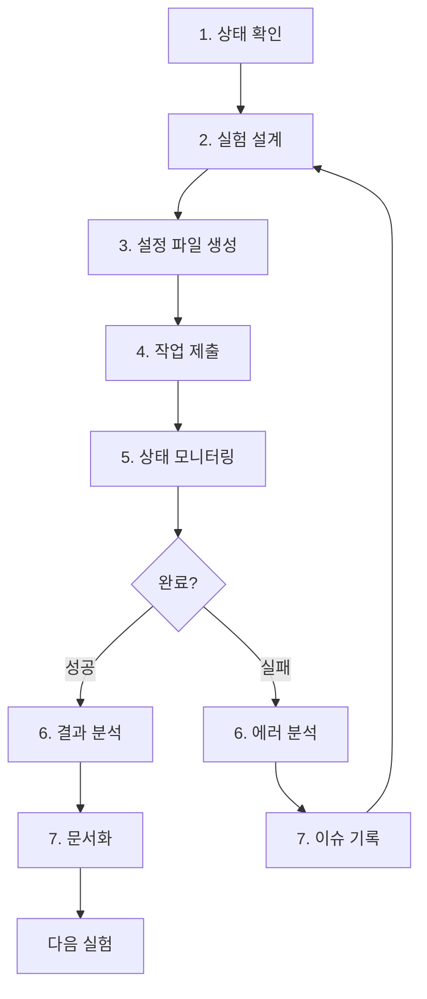

# AI Agent 운영 매뉴얼

이 문서는 AI 에이전트(VS Code Copilot 등)가 이 프로젝트를 **"Autonomous Researcher"**로서
운영할 때 따라야 하는 절차와 규칙을 정의합니다.

> **중요**: 이 매뉴얼은 `copilot-instructions.md`와 함께 사용됩니다.
> 코딩 가이드라인은 `copilot-instructions.md`를, 프로젝트 운영 절차는 이 문서를 참조하세요.

---

## 1. 에이전트 도구 개요

모든 프로젝트 운영 작업은 `tools/agent_tools/`의 Python 도구를 통해 수행합니다.
각 도구는 **JSON 형식으로 입출력**을 처리하여 파싱 오류를 방지합니다.

| 도구 | 용도 | 실행 예시 |
|------|------|----------|
| `get_status.py` | 프로젝트 상태 조회 (캐싱 지원) | `uv run python -m tools.agent_tools.get_status --detailed` |
| `submit_job.py` | SLURM 작업 제출 | `uv run python -m tools.agent_tools.submit_job --script run_experiment.sh --job-name exp1` |
| `wait_for_job.py` | 작업 완료 대기 | `uv run python -m tools.agent_tools.wait_for_job --job-id 12345` |
| `analyze_log.py` | 로그 분석/에러 요약 | `uv run python -m tools.agent_tools.analyze_log --job-id 12345` |
| `save_result.py` | 실험 결과 저장 | `uv run python -m tools.agent_tools.save_result --name exp1 --metrics '{}'` |
| `compare_results.py` | 결과 비교 분석 | `uv run python -m tools.agent_tools.compare_results --baseline a.json --target b.json` |
| `validate_config.py` | 설정 파일 검증 | `uv run python -m tools.agent_tools.validate_config --config exp.yaml` |

---

## 2. 실험 절차 (Experiment Workflow)

### 2.1 표준 실험 루틴



### 2.2 단계별 상세 절차

#### Step 1: 상태 확인 (필수)

**모든 작업 전에 반드시 현재 상태를 확인합니다.**

```bash
uv run python -m tools.agent_tools.get_status
```

확인할 사항:
- `running_count`: 현재 실행 중인 작업 수 (max: 4)
- `errors.count`: 처리되지 않은 에러 유무
- `summary.needs_attention`: 즉시 처리가 필요한 문제 유무

#### Step 2: 실험 설계

실험을 설계하기 전에 다음을 참조합니다:
1. `documents/PROJECT.md` - 현재 프로젝트 상태
2. `documents/todo.md` - 대기 중인 작업

#### Step 3: 설정 파일 생성

**⚠️ 기본 설정 파일을 직접 수정하지 마세요!**

새 설정 파일은 반드시 `configs/generated/` 폴더에 생성합니다:

```yaml
# configs/generated/2024-12-02_exp_lr_test.yaml
experiment:
  name: "lr_test_001"
  base_config: "../default.yaml"  # 기본 설정 참조
  
# 변경된 파라미터만 명시
training:
  learning_rate: 2e-4
```

#### Step 4: 작업 제출

```bash
uv run python -m tools.agent_tools.submit_job \
    --script run_experiment.sh \
    --job-name "lr_test_001" \
    --args "configs/generated/2024-12-02_exp_lr_test.yaml"
```

반환값 확인:
```json
{
  "status": "success",
  "job_id": "12345",
  "log_path": "logs/slurm/lr_test_001_12345.out"
}
```

#### Step 5: 상태 모니터링

작업 제출 후 주기적으로 상태를 확인합니다:

```bash
uv run python -m tools.agent_tools.get_status --section jobs
```

#### Step 6: 결과/에러 분석

**성공 시:**
- `results/` 폴더에서 결과 JSON 파일 확인
- 이전 실험과 비교 분석

**실패 시:**
```bash
uv run python -m tools.agent_tools.analyze_log --job-id 12345
```

**⚠️ 실패 시 즉시 재시도하지 마세요!** 반드시 원인을 분석하고 기록한 후 수정합니다.

#### Step 7: 문서화

모든 실험은 문서화합니다:

- **성공한 실험**: Memory MCP 사용 (`mcp_memory_store_memory`)
  - Tag: `experiment`, `note`
  - Content: 실험 목표, 설정, 결과 요약
- **실패한 실험**: Memory MCP 사용 (`mcp_memory_store_memory`)
  - Tag: `issue`, `failure`
  - Content: 에러 로그 요약, 분석, 원인

---

## 3. 안전 규칙 (Safety Rules)

### 3.1 리소스 제한

`configs/agent_policy.yaml`에 정의된 제한을 준수합니다:

| 항목 | 제한 | 설명 |
|------|------|------|
| `max_active_jobs` | 4 | 동시 실행 작업 수 |
| `max_pending_jobs` | 8 | 대기열 작업 수 |
| `max_daily_submissions` | 50 | 일일 제출 횟수 |

### 3.2 보호된 파일

다음 파일은 **절대 삭제하거나 덮어쓰면 안 됩니다**:

- `.github/copilot-instructions.md`
- `documents/PROJECT.md`
- `configs/agent_policy.yaml`
- `pyproject.toml`

### 3.3 금지 행동

1. ❌ `sbatch` 명령어 직접 실행 → ✅ `submit_job.py` 사용
2. ❌ `configs/default.yaml` 직접 수정 → ✅ `configs/generated/`에 새 파일 생성
3. ❌ 실패 후 즉시 재시도 → ✅ 원인 분석 후 Memory MCP에 기록 (`tag: issue`)
4. ❌ 결과 파일 직접 삭제 → ✅ 보관 정책에 따라 아카이브

---

## 4. 파일 규칙 (File Conventions)

### 4.1 설정 파일 저장

```text
configs/
├── default.yaml              # ❌ 수정 금지 (기본 설정)
├── model/                    # ❌ 수정 금지 (모델별 기본 설정)
├── agent_policy.yaml         # ❌ 수정 금지 (에이전트 정책)
└── generated/                # ✅ 에이전트가 생성하는 설정
    └── YYYY-MM-DD_<name>.yaml
```

### 4.2 결과 파일 명명

```text
results/
└── <experiment_type>/
    └── YYYY-MM-DD_HH-MM-SS_<experiment_name>.json
```

### 4.3 문서 파일

```text
documents/
├── final/                    # 🟢 최종 보고서 (Published)
├── drafts/                   # 🟡 초안 (Drafts)
└── reference/                # 🔵 참고 자료 (Reference)
```

**Memory MCP 사용 (파일 생성 금지):**
- 실험 노트 (`documents/notes/` 대체) → `mcp_memory_store_memory(tags=["note"])`
- 이슈 기록 (`documents/issues/` 대체) → `mcp_memory_store_memory(tags=["issue"])`
- 개발 계획 (`documents/development/` 대체) → `mcp_memory_store_memory(tags=["plan"])`

---

## 5. 결과 파일 스키마

모든 결과 JSON 파일은 다음 스키마를 따라야 합니다:

```json
{
  "experiment_name": "string (필수)",
  "timestamp": "ISO 8601 형식 (필수)",
  "status": "success | failed | cancelled",
  "config": {
    "실험에 사용된 전체 설정"
  },
  "config_diff": {
    "이전 실험 대비 변경된 파라미터만 (권장)"
  },
  "baseline_experiment": "비교 기준 실험 파일 경로 (권장)",
  "metrics": {
    "loss": 0.0,
    "accuracy": 0.0
  },
  "environment": {
    "git_commit": "string",
    "python_version": "string",
    "gpu": "string"
  },
  "notes": "실험 관련 메모"
}
```

### 5.1 config_diff 예시

```json
{
  "config_diff": {
    "training.learning_rate": {
      "from": 1e-4,
      "to": 2e-4
    },
    "training.batch_size": {
      "from": 8,
      "to": 16
    }
  },
  "baseline_experiment": "results/2024-12-01_baseline.json"
}
```

---

## 6. 에러 처리 절차

### 6.1 일반적인 에러 유형

| 에러 유형 | 원인 | 조치 |
|-----------|------|------|
| `OOM` | GPU 메모리 부족 | batch_size 감소, gradient_accumulation 증가 |
| `CUDA error` | GPU 관련 오류 | GPU 상태 확인, 다른 GPU로 재시도 |
| `ModuleNotFoundError` | 패키지 누락 | `uv add <package>` 실행 |
| `FileNotFoundError` | 파일 경로 오류 | 경로 확인 및 수정 |
| `SLURM timeout` | 시간 초과 | `--time` 옵션 증가 |

### 6.2 에러 분석 절차

1. `analyze_log.py`로 에러 요약 확인
2. `errors[0].context`에서 에러 컨텍스트 파악
3. Memory MCP에 이슈 기록 (`tag: issue`)
4. 원인과 해결책 기록
5. 설정 수정 후 재시도

---

## 7. 체크리스트

### 실험 시작 전
- [ ] `get_status.py`로 현재 상태 확인
- [ ] `running_count < max_active_jobs` 확인
- [ ] 이전 실험 결과 및 히스토리 확인
- [ ] 설정 파일을 `configs/generated/`에 생성

### 실험 종료 후
- [ ] 결과 파일에 필수 메타데이터 포함 확인
- [ ] `config_diff` 포함 (권장)
- [ ] Memory MCP에 실험 노트 작성 (`tag: note`)
- [ ] 실패 시 Memory MCP에 이슈 기록 (`tag: issue`)

### 주기적 점검
- [ ] `get_status.py --detailed`로 전체 상태 확인
- [ ] 처리되지 않은 에러 로그 확인
- [ ] 디스크 사용량 확인

---

## 8. 도구 명령어 요약

```bash
# 프로젝트 상태 조회
uv run python -m tools.agent_tools.get_status
uv run python -m tools.agent_tools.get_status --detailed
uv run python -m tools.agent_tools.get_status --section jobs
uv run python -m tools.agent_tools.get_status --no-cache  # 캐시 무시

# 작업 제출
uv run python -m tools.agent_tools.submit_job --script run_experiment.sh --job-name <name>
uv run python -m tools.agent_tools.submit_job --script run_experiment.sh --job-name <name> --dry-run

# 작업 완료 대기
uv run python -m tools.agent_tools.wait_for_job --job-id <job_id>
uv run python -m tools.agent_tools.wait_for_job --job-id <job_id> --timeout 3600
uv run python -m tools.agent_tools.wait_for_job --job-id <job_id> --no-wait  # 상태만 확인

# 로그 분석
uv run python -m tools.agent_tools.analyze_log --job-id <job_id>
uv run python -m tools.agent_tools.analyze_log --path logs/slurm/<file>.err
uv run python -m tools.agent_tools.analyze_log --recent-errors

# 결과 저장
uv run python -m tools.agent_tools.save_result --name <name> --metrics '{"loss": 0.1}'
uv run python -m tools.agent_tools.save_result --name <name> --metrics '{}' --config config.yaml

# 결과 비교
uv run python -m tools.agent_tools.compare_results --baseline results/a.json --target results/b.json

# 설정 검증
uv run python -m tools.agent_tools.validate_config --config configs/generated/exp.yaml
uv run python -m tools.agent_tools.validate_config --config exp.yaml --strict  # 엄격 모드
```

---

**최종 업데이트**: 2026-01-14

